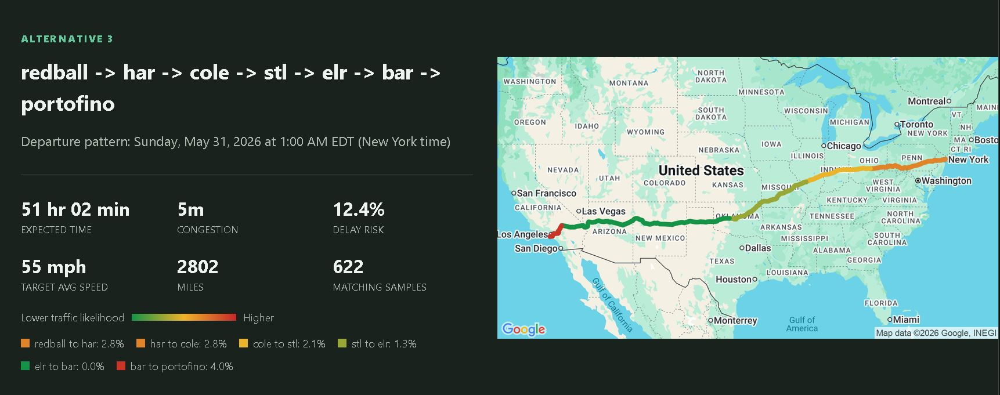

# CannonMiner

CannonMiner is a PHP 8.2 web application for comparing routes and recurring
departure windows against historical traffic-delay observations. It includes
authentication, route maps, database-backed configuration, scheduled
collection, and reports for traffic windows to avoid.

## Example screenshot



## Supported installation

Only Debian based linux distributions are currently supported.

Use the following commands to install:
```bash
git clone https://github.com/DLTaylor02/CannonMiner.git
cd CannonMiner
cp .env.example .env
nano .env #define your existing Postgres configuration or desired configuration
chmod +x setup.sh
./setup.sh
```

Use a different absolute deployment directory when necessary:
```bash
CANNONMINER_INSTALL_DIR=/srv/cannonminer bash setup.sh
```

The script installs and validates dependencies as well as installing the app itself:

- PHP 8.2 or newer, PHP-FPM, and the PostgreSQL, XML, mbstring, and cURL extensions
- Composer 2 and all PHP packages in `composer.json`
- PostgreSQL server and client
- Nginx
- cron

During installation, setup asks which Nginx port CannonMiner should use. Press
Enter to accept port `3636`. CannonMiner is installed as an independent Nginx
site and does not replace, disable, or modify existing sites. Choose another
unused port if `3636` is already occupied. The port may also need to be allowed
through the server firewall.

See `Docs\How to setup API key.md` for instructions on how to setup your API key.
During first-time database setup, the installer prompts for the Google Maps API
key with hidden input. You can enter the API key at this time or press Enter to
skip it and add the key later under WebUI Settings. 

When the deployment does not already have an `.env`, setup securely copies the
one from the source checkout to `/var/www/cannonminer/.env`. If neither location
has one, setup creates a new `cannonminer` database and application account.

After the script completes, it prints the address including the selected port,
for example `http://192.168.1.106:3636/`.

## Diagnostics

Run the installed-system test suite after setup or an upgrade:

```bash
cd /var/www/cannonminer
composer test
```

## User Management

- The installer will create a **superadmin** to manage all settings, segments, and users. Its role cannot be assigned, removed, or transferred in the WebUI. If you lose access to the superadmin account it can be reset with the following commands:
```bash
cd /var/www/cannonminer
composer reset-superadmin-password
```
- **Web admin**s can manage segments, users, and the default maximum risk. They cannot read or change the Google key, collection interval, or other collection settings.
- **User**s can run route analysis and view avoid trends. Route jobs always enforce the configured maximum risk for this role.

## Route selection

CannonMiner finds the available routes between the selected starting point and destination. For each route, it tests departure times throughout every weekday and month represented in the collected traffic data, using 15-minute intervals by default.
Each route and departure-time combination is evaluated using:
- Distance and the selected target average speed
- Typical historical delay for each segment
- Traffic observations near the estimated time the vehicle would reach each segment
- Seasonal and weekday traffic patterns
- Simulated delay outcomes based on the collected delay distribution
- The probability of a meaningful slowdown on any segment or across the complete route
Options exceeding the selected maximum delay risk are excluded when possible. Balanced and Fastest then favor the lowest expected travel time, with delay risk used as a tie-breaker. Reliability favors the lowest delay risk first, with expected travel time used as a tie-breaker.
The three highest-ranked combinations are displayed. If no option satisfies the maximum-risk setting, CannonMiner displays the best available alternatives instead of returning no result.

## Layout

- `public/`: Nginx web root
- `src/Router.php`: route scoring
- `src/Collector.php`: Google Directions collection
- `database/`: schema, seeds, and legacy migration
- `templates/`: Twig UI
- `bin/collect.php`: manual and scheduled collector
