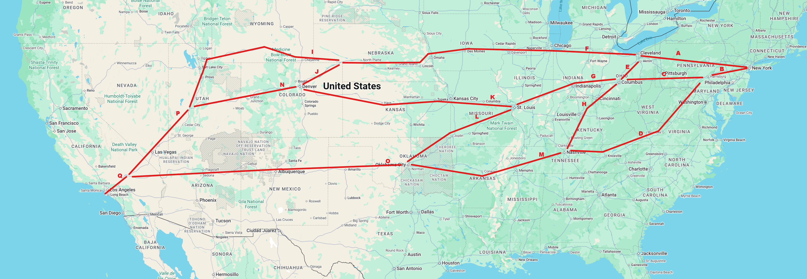

# CannonMiner

For a trip from the Redball Garage in New York to the Portofino Marina Hotel in Los Angeles, which route/departure pair gives the fastest arrival while keeping the risk of a costly delay acceptably low?

I run a custom-built Cannonball routing platform that models real-world traffic variability instead of chasing average speed. It evaluates all viable route segments between endpoints, penalizes high-variance traffic behavior, and selects routes and departure times that are statistically least likely to experience delay at a target cruising speed. The result is a risk-optimized route designed for consistency under real conditions.

## Setup

1. Install Debian

2. Install and setup a PostgreSQL server
```shell
apt install -y postgresql postgresql-contrib
systemctl enable --now postgresql
sudo -i -u postgres
psql
ALTER USER postgres WITH PASSWORD '<your_strong_password>';
\q
exit
sed -i "s/#listen_addresses = 'localhost'/listen_addresses = '*'/g" /etc/postgresql/*/main/postgresql.conf
echo "host    all    all    192.168.1.0/24    md5" | sudo tee -a /etc/postgresql/*/main/pg_hba.conf
systemctl restart postgresql
```

3. Create a new database named cannonminer

4. Install dependencies and setup environment
```shell
apt install -y python3 python3-venv python3-pip
mkdir -p ~/projects/cannonminer
cd ~/projects/cannonminer/
python3 -m venv venv
source venv/bin/activate
pip install --upgrade pip
pip install requests "psycopg[binary]" sqlalchemy pydantic tenacity networkx numpy tqdm
```

5. Clone this repository to ~/projects/cannonminer

6. Define your DB connection in db_config.py

7. Setup your Google API key and add it to maps_key.py. Instructions for this if you need it can be found in the Docs folder.

8. If you'd like to add, remove, or change potential routes you can do this in the in the segments folder. A file already exists for each standard route segement.

9. Create cronjob
Update the username in run_main.sh
Make it executable
```shell
chmod +x /home/<your_username>/projects/cannonminer/run_main.sh
```
Create the schedule
```shell
crontab -e
```
```shell
0 * * * * /home/<your_username>/projects/cannonminer/run_main.sh >> /home/<your_username>/projects/cannonminer/run.log 2>&1
```

10. Collect as much data as possible. The longer you let this run the more data it will find.

11. Run the router.py to analyse the data
Modes:
    default           -> Balanced
    fastest           -> Minimize predicted duration
    reliability       -> Minimize variance (high confidence but ignores real world cronology)
```shell
cd ~/projects/cannonminer
source ~/projects/cannonminer/venv/bin/activate
python router.py <startlocation> <endlocation> <avgmph>
```

## Default Segments



## Dev Todos

- Refactor the file structure of this
  - It works great but looks messy af
- Make it more POSIX compliant, it should work on just about any flavor of 'nix not just Debian and its children.